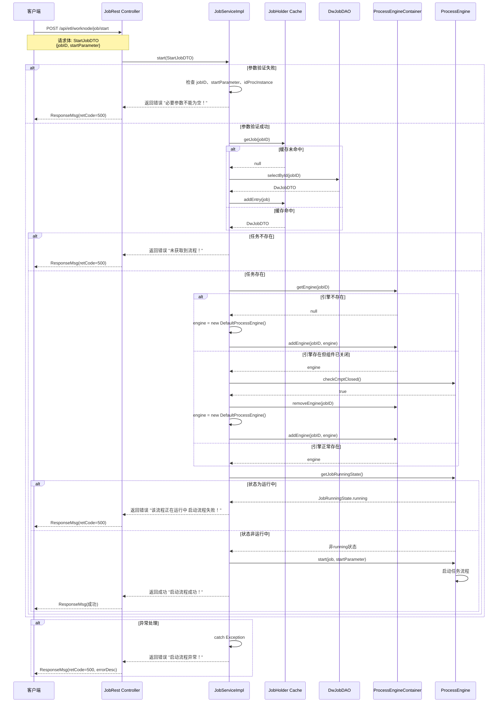

# ETL任务管理 - Start接口执行流程图

## 概述

本文档详细说明了ETL工作节点中`/api/etl/worknode/job/start`接口的执行流程，从接收HTTP请求到启动任务引擎的完整过程。

## 流程图



## 详细执行步骤

### 1. 接收HTTP请求

**类**: `JobRest`  
**方法**: `start(@RequestBody StartJobDTO startJob)`  
**路径**: `POST /api/etl/worknode/job/start`

- 接收JSON格式的请求体，包含：
  - `jobID`: 任务ID
  - `startParameter`: 启动参数（包含idProcInstance等）

### 2. 参数验证

**类**: `JobServiceImpl`  
**方法**: `start(StartJobDTO startJob)`

验证以下必要参数：
- `startJob` 不为null
- `startJob.getJobID()` 不为空
- `startJob.getStartParameter()` 不为null
- `startJob.getStartParameter().getIdProcInstance()` 不为空

**失败返回**: `retCode=500`, `message="必要参数不能为空！"`

### 3. 获取任务信息

#### 3.1 从缓存获取
- 调用 `JobHolder.getInstance().getJob(jobID)` 从内存缓存获取任务信息
- `JobHolder` 使用单例模式，维护一个 `HashMap<String, DwJobDTO>` 存储任务信息

#### 3.2 缓存未命中时从数据库加载
- 调用 `jobMapper.selectById(jobID)` 从数据库查询任务
- 将查询结果添加到缓存：`JobHolder.getInstance().addEntry(job)`

#### 3.3 任务不存在
**失败返回**: `retCode=500`, `message="未获取到流程！"`

### 4. 获取或创建流程引擎

**类**: `ProcessEngineContainer`

容器使用 `ConcurrentHashMap<String, ProcessEngine>` 管理引擎实例，key为jobID。

#### 4.1 引擎不存在
- 创建新引擎：`engine = new DefaultProcessEngine()`
- 添加到容器：`processEngineContainer.addEngine(jobID, engine)`

#### 4.2 引擎存在但组件已关闭
- 检查：`engine.checkCmptClosed()` 返回 true
- 说明：这是之前运行的遗留数据
- 操作：
  1. 移除旧引擎：`processEngineContainer.removeEngine(jobID)`
  2. 创建新引擎：`engine = new DefaultProcessEngine()`
  3. 添加新引擎：`processEngineContainer.addEngine(jobID, engine)`

#### 4.3 引擎正常存在
- 直接使用现有引擎实例

### 5. 检查任务运行状态

调用 `engine.getJobRunningState()` 获取当前运行状态。

#### 5.1 任务正在运行
- 条件：`engine.getJobRunningState() == JobRunningState.running`
- **失败返回**: `retCode=500`, `message="该流程正在运行中 启动流程失败！"`

#### 5.2 任务未运行
- 条件：状态不是 `JobRunningState.running`
- 执行：`engine.start(job, startParameter)` 启动流程
- **成功返回**: `message="启动流程成功！"`

### 6. 异常处理

任何步骤发生异常：
- 捕获异常
- 记录日志：`log.error("启动流程异常！", e)`
- 返回错误响应：
  - `retCode=500`
  - `message="启动流程异常！"`
  - `errorDesc=e.getMessage()`

## 关键组件说明

### StartJobDTO
启动任务的数据传输对象：
```java
public class StartJobDTO {
    private String jobID;                    // 任务ID
    private StartParameterDTO startParameter; // 启动参数
}
```

### JobHolder
单例模式的任务缓存：
- 使用 `HashMap` 存储任务信息
- 提供 `getJob()`、`addEntry()`、`removeEntry()` 方法
- 减少数据库访问，提高性能

### ProcessEngineContainer
流程引擎容器：
- 使用 `ConcurrentHashMap` 管理引擎实例
- 线程安全，支持并发访问
- 一个任务对应一个引擎实例

### ProcessEngine
流程引擎接口：
- `getJobRunningState()`: 获取运行状态
- `checkCmptClosed()`: 检查组件是否关闭
- `start(job, startParameter)`: 启动流程

## 核心设计模式

### 1. 单例模式
- `JobHolder` 使用单例模式确保全局唯一的缓存实例

### 2. 容器模式
- `ProcessEngineContainer` 管理多个引擎实例的生命周期

### 3. 缓存模式
- 两级获取机制：先查缓存，缓存未命中再查数据库

### 4. 状态检查模式
- 启动前检查引擎状态，防止重复启动

## 错误响应汇总

| 错误场景 | retCode | message |
|---------|---------|---------|
| 参数验证失败 | 500 | 必要参数不能为空！ |
| 任务不存在 | 500 | 未获取到流程！ |
| 任务正在运行 | 500 | 该流程正在运行中 启动流程失败！ |
| 系统异常 | 500 | 启动流程异常！ |

## 成功响应

```json
{
  "message": "启动流程成功！",
  "retCode": null
}
```

## 并发控制

1. **引擎容器**: 使用 `ConcurrentHashMap` 保证线程安全
2. **状态检查**: 启动前检查 `JobRunningState`，防止重复启动
3. **引擎隔离**: 每个任务使用独立的引擎实例，互不干扰

## 优化建议

1. **缓存一致性**: JobHolder 使用 HashMap，在多线程环境下可能存在并发问题，建议改用 ConcurrentHashMap
2. **参数验证**: 可以使用 Spring Validation 注解简化参数验证逻辑
3. **返回码标准化**: 建议使用常量定义错误码，而不是硬编码 "500"
4. **日志增强**: 关键步骤增加 debug 日志，便于问题排查
5. **事务管理**: 考虑添加事务管理，确保数据库操作的一致性

## 相关接口

### Stop接口
- **路径**: `POST /api/etl/worknode/job/stop`
- **功能**: 停止运行中的任务
- **核心逻辑**: 调用 `engine.stop()` 并更新数据库状态

### State接口
- **路径**: `GET /api/etl/worknode/job/state`
- **功能**: 查询任务运行状态
- **核心逻辑**: 从数据库查询 `job.getRunningState()`

## 总结

Start接口的执行流程体现了以下设计特点：

1. **健壮性**: 完善的参数验证和异常处理
2. **性能**: 使用缓存减少数据库访问
3. **并发控制**: 通过状态检查防止重复启动
4. **生命周期管理**: 自动清理已关闭的引擎实例
5. **可维护性**: 清晰的分层架构和职责划分
